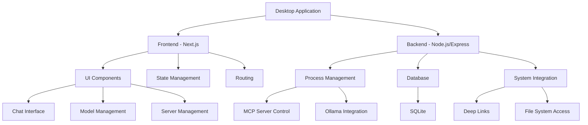

# MCP Desktop Application Architecture

## Overview

This document outlines the architecture for a Node.js-based equivalent of the Tome MCP desktop application.

## Technology Stack

Original Tome | Proposed Stack | Purpose
---|---|---
Tauri (Desktop) | Electron | Desktop application runtime
Rust Backend | Node.js/Express | System-level operations
SvelteKit | Next.js | Frontend framework
SQLite (via Tauri) | SQLite3 (node) | Database
Tailwind CSS | Tailwind CSS | Styling
TypeScript | TypeScript | Type safety
- | Prisma | Database ORM
- | Redux Toolkit | State management
- | Socket.io | Real-time communications

## Core Components



## Project Structure

```
mcp-desktop/
├── electron/              # Electron main process
│   ├── main.ts
│   ├── preload.ts
│   └── ipc/
├── src/
│   ├── app/              # Next.js pages
│   ├── components/       # React components
│   ├── lib/             # Shared utilities
│   ├── server/          # Express backend
│   │   ├── api/         # API routes
│   │   ├── services/    # Business logic
│   │   └── process/     # Process management
│   └── types/           # TypeScript types
├── prisma/              # Database schema
└── public/             # Static assets
```

## Key Challenges and Solutions

### 1. System Integration
- **Need**: Node.js modules for system process management
- **Solution**: 
  - node-pty for process control
  - child_process for running MCP servers
  - node-ipc for inter-process communication

### 2. Desktop Features
- **Need**: Deep linking support
- **Solution**:
  - Electron protocol handler
  - Custom URL scheme registration
  - System tray integration

### 3. Database Access
- **Need**: Local data persistence
- **Solution**:
  - Prisma + SQLite
  - Migration management
  - Type-safe queries

### 4. Process Management
- **Need**: MCP server management
- **Solution**:
  - PM2 or custom process manager
  - Log management
  - Process lifecycle control

## Development Phases

### Phase 1: Core Infrastructure
- Set up Electron with Next.js
- Implement database with Prisma
- Basic IPC communication

### Phase 2: System Integration
- Process management system
- Ollama integration
- File system access

### Phase 3: UI Implementation
- Chat interface
- Model management
- Server controls

### Phase 4: Advanced Features
- Deep linking
- Marketplace integration
- Real-time updates

## Required Dependencies

```json
{
  "dependencies": {
    "electron": "latest",
    "next": "latest",
    "express": "latest",
    "prisma": "latest",
    "@prisma/client": "latest",
    "node-pty": "latest",
    "socket.io": "latest",
    "@reduxjs/toolkit": "latest",
    "tailwindcss": "latest",
    "typescript": "latest",
    "node-ipc": "latest",
    "pm2": "latest"
  }
}
```
